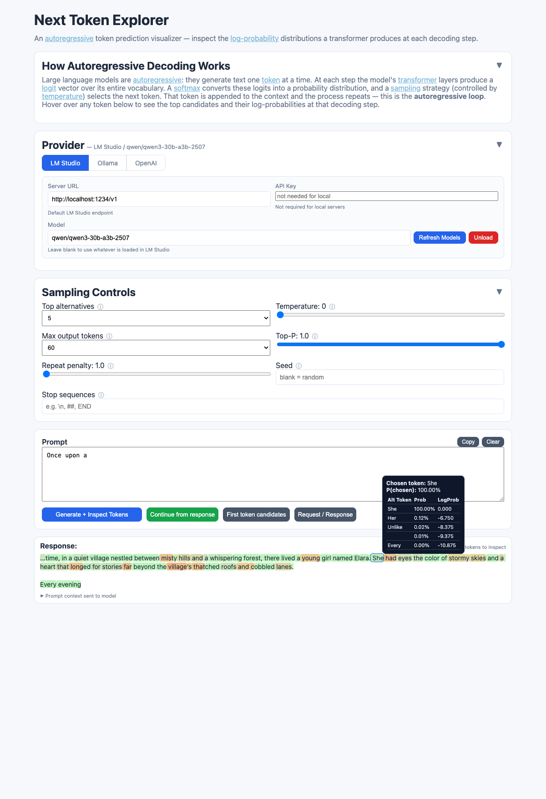

# Next Token Explorer

An educational [autoregressive](https://en.wikipedia.org/wiki/Autoregressive_model) token prediction visualizer. It exposes the [log-probability](https://en.wikipedia.org/wiki/Log_probability) distributions a [transformer](https://en.wikipedia.org/wiki/Transformer_(deep_learning_architecture)) produces at each decoding step — showing not just the token selected, but the full ranked list of candidates the model considered and their probabilities.



## Why This Exists

Large language models can feel like magic — you type a question and a coherent answer appears. But underneath, the process is mechanical and probabilistic. This repo was built to pull back the curtain and make that process visible.

Modern LLMs are built on the **transformer architecture** introduced in the 2017 paper [*Attention Is All You Need*](https://arxiv.org/abs/1706.03762) (Vaswani et al.). At their core, transformers work by repeatedly answering one question: **given everything so far, what token comes next?**

At each step the model produces a probability distribution over its entire vocabulary — tens of thousands of possible tokens — and selects one. That selected token is appended to the context and the process repeats. The full response is built up one token at a time through this autoregressive loop.

## What Are Logprobs?

**Logprobs** (log-probabilities) are the natural logarithm of the probability the model assigns to each candidate token. If a model is 90% confident the next token is "time", it assigns a probability of 0.90 and a logprob of ln(0.90) ≈ −0.105. Lower (more negative) logprobs mean lower confidence.

Why logarithms? Probabilities can be extremely small numbers (e.g. 0.000001). Working in log-space keeps the math numerically stable and makes it easier to compare relative likelihoods.

When a model exposes logprobs through its API, we can see not just the token it chose, but the **top alternatives it considered and how confident it was in each one**. This is the data this tool visualizes.

## How This Helps Understand LLMs

By exploring logprobs interactively, you can observe several key concepts from the transformer architecture first-hand:

- **[Autoregressive decoding](https://en.wikipedia.org/wiki/Autoregressive_model)** — text is generated one token at a time through a sequential loop. At each step, the model conditions on all previous tokens to predict the next one. This is the core mechanism behind every modern LLM — GPT, LLaMA, Mistral, and others all work this way.
- **[Logits](https://en.wikipedia.org/wiki/Logit) and [softmax](https://en.wikipedia.org/wiki/Softmax_function)** — the model's transformer layers output a raw logit score for every token in its vocabulary (often 32,000–128,000 tokens). The softmax function converts these logits into a probability distribution that sums to 1. The logprobs you see here are `ln(probability)` — the log of that softmax output.
- **[Sampling](https://en.wikipedia.org/wiki/Sampling_(statistics)) and temperature** — at temperature 0, the model always picks the highest-probability token ([greedy decoding](https://en.wikipedia.org/wiki/Greedy_algorithm)). As temperature rises, the softmax distribution flattens, giving lower-probability tokens a better chance. This is why higher temperatures produce more varied and creative — but less predictable — output.
- **[Entropy](https://en.wikipedia.org/wiki/Entropy_(information_theory)) and uncertainty** — when probability is spread across many alternatives, the distribution has high entropy and the model is uncertain. You can see this visually: green tokens are high-confidence (low entropy), red tokens are low-confidence (high entropy). This directly relates to [perplexity](https://en.wikipedia.org/wiki/Perplexity), a standard metric for evaluating language models.
- **[Tokenization](https://en.wikipedia.org/wiki/Lexical_analysis#Tokenization)** — LLMs don't operate on words. They use sub-word tokenization schemes like [BPE](https://en.wikipedia.org/wiki/Byte_pair_encoding) (Byte Pair Encoding) that split text into pieces the model learned during training. This is why "unfortunately" might be one token while "indubitably" splits into three. Hovering over tokens makes this segmentation visible.
- **[Attention mechanism](https://en.wikipedia.org/wiki/Attention_(machine_learning))** — the transformer's [self-attention](https://en.wikipedia.org/wiki/Attention_(machine_learning)#Self-attention) layers are what allow each token prediction to consider the full context. This is the key innovation from the [*Attention Is All You Need*](https://arxiv.org/abs/1706.03762) paper that made modern LLMs possible.

These are the same mechanisms behind prompt engineering, [hallucination](https://en.wikipedia.org/wiki/Hallucination_(artificial_intelligence)), and why models sometimes produce surprising output. Seeing the probability distributions directly builds intuition that no amount of abstract explanation can.

## Supported Providers

| Provider | Default URL | API Key | Logprobs Endpoint |
|----------|-------------|---------|-------------------|
| **LM Studio** | `http://localhost:1234` | Not needed | `/v1/responses` (Open Responses spec) |
| **Ollama** | `http://localhost:11434` | Not needed | `/api/chat` (native API) |
| **OpenAI** | `https://api.openai.com/v1` | Required | `/v1/chat/completions` |

**Important:** Each provider requires a different API endpoint for logprobs:
- **LM Studio** — `/v1/chat/completions` silently ignores the `logprobs` parameter. This app uses the `/v1/responses` endpoint (Open Responses spec) instead, which correctly returns logprobs.
- **Ollama** — `/v1/chat/completions` (OpenAI-compat) does not support logprobs. This app uses the native `/api/chat` endpoint (requires Ollama v0.12.11+).
- **OpenAI** — `/v1/chat/completions` works as expected.

See [LOGPROBS-SUPPORT.md](LOGPROBS-SUPPORT.md) for full research details, including probe request examples, model unloading, CLI tools, and version requirements.

## Setup

```bash
npm install
npm start
```

Open http://localhost:3000

That's it for local models (LM Studio / Ollama). For OpenAI, either:

- Paste your API key into the web UI (it's password-masked, sent per-request, and never stored), or
- Set the environment variable before starting:
  ```bash
  export OPENAI_API_KEY="sk-..."
  npm start
  ```

## Model Scanner

Not all provider/model combinations may return logprobs correctly. The scanner probes each model with a minimal single-token request, unloads it to free memory, and records the result.

```bash
npm run scan              # scan both Ollama and LM Studio
npm run scan:ollama       # scan Ollama only
npm run scan:lmstudio     # scan LM Studio only
npm run scan:rescan       # ignore history, re-test everything
```

Custom endpoints:
```bash
node scan-models.js --ollama-url http://192.168.1.50:11434
node scan-models.js --lmstudio-url http://192.168.1.50:1234
```

The scanner uses the correct native endpoint per provider:
- **Ollama** — probes via `/api/chat` with `logprobs: true`
- **LM Studio** — probes via `/v1/responses` with `include: ["message.output_text.logprobs"]`

Embedding and reranker models are automatically skipped.

The scanner produces two files:

- **`supported.json`** — full results with model metadata (parameter size, quantization, file size, logprobs support). Read by the app on startup to populate the model dropdown with support badges and size info. Ollama provides rich metadata via `/api/tags`; LM Studio metadata comes from `lms ls --json --llm` CLI (falls back to `/v1/models` API which only returns model IDs).
- **`scan-history.json`** — records every model tested (pass or fail) so subsequent runs skip previously scanned models. History is saved after each individual probe, so progress survives interruptions. Use `npm run scan:rescan` to clear history and re-test everything.

When the app starts, if `supported.json` exists, the model dropdown shows:
- Model name, parameter size, quantization, and file size
- A colored badge: **green** (logprobs confirmed), **red** (no logprobs), or **gray** (unscanned)
- Models sorted: supported first, then unscanned, then unsupported

## Educational Goal

Help beginners understand that:

1. LLMs generate one token at a time.
2. Each step is a probability distribution over many possible tokens.
3. The selected token has alternatives that were not chosen.
4. Temperature changes how deterministic vs varied the selection becomes.

## How It Works

- **Hover any token** to see the top alternatives and their probabilities
- Token colors show confidence: **green** (high probability) through **yellow**, **orange**, to **red** (low probability)
- The first-token summary shows a table and bar chart of candidates
- Toggle "Show raw JSON" to inspect the full API response
- **Refresh Models** fetches available models from the provider with a searchable dropdown
- **Unload** frees the current model from GPU/RAM before switching
- **Continue from response** appends the model's output to your prompt and generates again using multi-turn conversation messages, preserving all formatting (newlines, special characters, emojis) across rounds
- **Copy** button copies the full response with exact formatting to clipboard

## UI Layout

The interface is designed for focus:

- **Provider**, **Sampling Controls**, and **How it Works** sections are collapsible — click the header to expand/collapse
- **Prompt** and **Response** are always visible and take up most of the screen
- The prompt textarea can be resized to use the full screen
- Prompt context sent to the model is shown collapsed under the Response section
- The model dropdown is searchable — type in the model input and press Enter to filter

## Architecture

```text
next-token-explorer/
├── index.html            # Single-page frontend (vanilla HTML/CSS/JS)
├── server.js             # Express backend, routes to provider-native APIs
├── scan-models.js        # Model scanner — probes logprobs support
├── package.json          # Dependencies and npm scripts
├── package-lock.json     # Locked dependency versions
├── LOGPROBS-SUPPORT.md   # Provider logprobs research and endpoint documentation
├── README.md
├── supported.json        # Scanner output (generated, gitignored)
└── scan-history.json     # Scanner cache (generated, gitignored)
```

- **Frontend (`index.html`)** — Collapsible provider tabs, searchable model dropdown with size/support badges, prompt controls with continue-from-response (multi-turn), tokenized response with hover tooltips and collapsed prompt context, first-token summary bars, model unload button, raw JSON toggle. API key input is password-masked. Response text is derived from actual token strings to preserve exact formatting.
- **Backend (`server.js`)** — Each provider has its own code path using the endpoint that actually supports logprobs:
  - **Ollama** → `/api/chat` (native API)
  - **LM Studio** → `/v1/responses` (Open Responses spec)
  - **OpenAI** → `/v1/chat/completions` (OpenAI SDK)
  Nothing is stored server-side; all config flows per-request from the frontend.
- **Scanner (`scan-models.js`)** — Discovers models from Ollama (`/api/tags`) and LM Studio (`lms ls --json --llm` CLI, falls back to `/v1/models` API), probes each using the provider's native logprobs endpoint, unloads after each test, writes results to `supported.json` and caches to `scan-history.json`. Automatically skips embedding/reranker models.

## API

### `POST /api/token-walk`

Generate a multi-token response with logprobs for each token. Optionally pass `messages` for multi-turn continuation.

```json
{
  "prompt": "Once upon a",
  "model": "gpt-4.1-mini",
  "temperature": 0.4,
  "top_logprobs": 5,
  "max_output_tokens": 60,
  "provider": {
    "provider": "lmstudio",
    "baseUrl": "http://localhost:1234/v1"
  },
  "messages": [
    { "role": "user", "content": "Once upon a" },
    { "role": "assistant", "content": " time in a land far away..." },
    { "role": "user", "content": "Continue." }
  ]
}
```

Response:

```json
{
  "prompt": "Once upon a",
  "response_text": " time...",
  "token_count": 12,
  "tokens": [
    {
      "token": " time",
      "logprob": -0.12,
      "probability": 0.887,
      "top_alternatives": [
        { "token": " time", "logprob": -0.12, "probability": 0.887 },
        { "token": " day", "logprob": -2.0, "probability": 0.135 }
      ]
    }
  ]
}
```

### `POST /api/next-token`

Same shape but returns only the first predicted token. Useful for single-step demonstrations.

### `POST /api/models`

List available models from the selected provider with rich metadata. Ollama models include parameter size, quantization, file size, and family from `/api/tags`. LM Studio models include the same via `lms ls --json --llm` CLI (falls back to `/v1/models` API with minimal data). Returns `{ "models": [{ "id": "...", "parameter_size": "...", "quantization": "...", "size_bytes": ..., "size_display": "...", "family": "...", "format": "..." }] }`.

### `POST /api/unload`

Unload a model from memory. Ollama uses `keep_alive: 0`; LM Studio uses `/api/v1/models/unload`.

```json
{
  "model": "llama3:latest",
  "provider": { "provider": "ollama" }
}
```

### `GET /api/supported-models`

Returns the contents of `supported.json` if available, or `{ "available": false }` if no scan has been run.

### `GET /api/has-env-key`

Returns `{ "hasKey": true/false }` — lets the UI hint when an environment key is available.

## Example Teaching Prompts

- `The capital of France is`
- `2 + 2 =`
- `Once upon a`
- `The opposite of hot is`
- `A dog says`

## Security

- API keys entered in the UI are password-masked, sent per-request over the local network, and never written to disk.
- For OpenAI, you can alternatively set `OPENAI_API_KEY` as an environment variable.
- Local providers (LM Studio, Ollama) don't require any keys.
